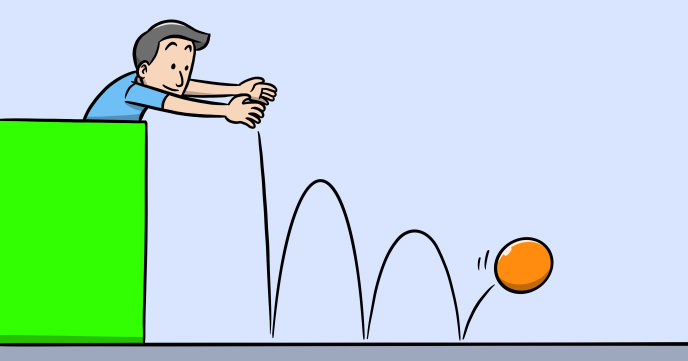

This program is a simulation of a series of balls dropped from a certain height.

The program uses real world concepts such as gravity and speed in order to determine the position of each ball.

What you’ll learn?

-	How a physic engine works?
-	How to simulate real word movement?
-	How to use arrow functions?
 
## Source code 
The JavaScript source code of this program can be found [here](sketches/program.js). To run it, you need to import it in the [codeguppy.com](https://codeguppy.com) online editor. Alternatively, you can use the source code in your p5.js sketches (advanced use). 
## Online version 
To see the code running, check the online playground at [https://codeguppy.com/code.html?t=jumping_balls](https://codeguppy.com/code.html?t=jumping_balls) 
## Next steps 
Please check [codeguppy.com](https://codeguppy.com) for many other fun JavaScript programs and games for beginners. To stay up to date with CodeGuppy development please follow [@codeguppy](https://twitter.com/codeguppy) on Twitter.  
